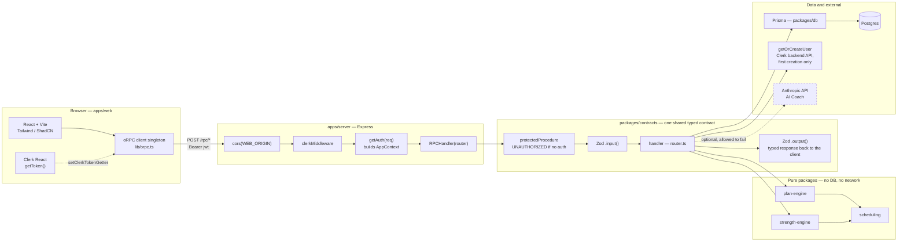
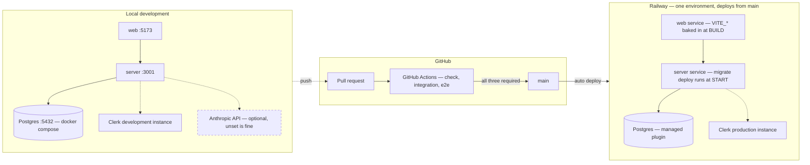

# Cadenza — marathon training app

A marathon training app for a first-time marathoner who is also a seasoned lifter and an active cyclist: goal intake, a generated periodized running plan, a scheduled strength program that coordinates with it, session logging, and a dashboard showing planned vs. logged.

Built as a technical work sample. The repository and package names are `firstloop-marathon-app` / `@firstloop/*` — the product name and the technical name are deliberately separate, and the packages were not renamed.

- **Write-up:** [docs/WRITEUP.md](./docs/WRITEUP.md) — what was built, the tradeoffs, and what is honestly not there
- **Decisions log:** [DECISIONS.md](./DECISIONS.md) — every real architecture and scope decision, with its reasoning
- **Roadmap:** [docs/ROADMAP.md](./docs/ROADMAP.md) — the sequenced checkpoint plan, and what has to happen before the schema-touching work
- **Specs:** [docs/specs/](./docs/specs/) — plain-language rules written before implementation, for work that changes how the system decides things
- **Reviews:** [docs/reviews/](./docs/reviews/) — step-back persona and UX evaluations, with findings and triage
- **Video outline:** [docs/video-outline.md](./docs/video-outline.md)

Bun workspaces monorepo: Express + Prisma/Postgres backend, Vite/React frontend, Zod + oRPC as the shared typed contract, Clerk for auth.

## Architecture

### Request flow



`apps/web` imports the router's **type** only. Zod schemas needed as runtime values come from the `@firstloop/contracts/schemas/*` subpath, never the package root — the root barrel re-exports the router, which reaches Prisma. See [DECISIONS.md](./DECISIONS.md), Checkpoint 4.

### Deployment topology



A single Railway environment is a deliberate choice, not an omission: a full dev/pre-prod/prod split was built out completely — branch, CI trigger, branch protection — then reverted on discovering Railway requires a paid plan for a second environment. See [DECISIONS.md](./DECISIONS.md), Checkpoint 8.

## Local setup

**Prerequisites:** [Bun](https://bun.sh) and Docker.

```bash
git clone https://github.com/lizorsini54/firstloop-marathon-app.git
cd firstloop-marathon-app
cp .env.example .env          # then fill in the Clerk keys, see below
docker compose up -d          # Postgres only — the apps run natively
bun install                   # also runs prisma generate via postinstall
bun run --filter '@firstloop/db' db:migrate
bun run --filter '@firstloop/db' db:seed    # optional, see note below
bun run dev
```

Web app on http://localhost:5173, server on http://localhost:3001.

### Environment variables

| Variable | Required | Notes |
|---|---|---|
| `DATABASE_URL` | yes | Matches `docker-compose.yml` as shipped; no change needed for local work |
| `CLERK_SECRET_KEY` | yes | Clerk dashboard → API keys. The server refuses to boot without it |
| `CLERK_PUBLISHABLE_KEY` | yes | Same Clerk instance as the secret key; also validated at boot |
| `VITE_API_URL` | yes | Full URL **including scheme** — a bare domain breaks the oRPC client's URL parsing |
| `VITE_CLERK_PUBLISHABLE_KEY` | yes | Same value as `CLERK_PUBLISHABLE_KEY`; the `VITE_` prefix is what exposes it to the client |
| `SERVER_PORT` | no | Defaults to `3001`. `PORT` wins over it when set, which is how Railway injects the port |
| `WEB_ORIGIN` | no | Defaults to `http://localhost:5173`. Used for CORS; in deployment it needs the full origin **including scheme** |
| `ANTHROPIC_API_KEY` | no | Powers the AI Coach card only. Leave it unset and that endpoint reports itself unavailable — nothing else breaks, and no test or CI run needs it |

Only the Clerk pair and `DATABASE_URL` are genuinely load-bearing: `apps/server/src/env.ts` validates its environment with Zod at boot and fails fast on those, while `SERVER_PORT` and `WEB_ORIGIN` carry working local defaults. `.env.example` ships every one of them with sensible local values already filled in except the Clerk keys.

Clerk keys are the one thing you have to supply yourself: create a free Clerk application and use its development instance keys locally.

**About `db:seed`:** it hardcodes one specific Clerk test account's user ID and email and generates roughly eight weeks of training history for it. It is useful for looking at a populated dashboard, but it only produces data for *that* account — signing in as any other Clerk user gives you the genuine new-user experience instead, which is also worth seeing. The script is safe to re-run; it clears that user's plans and logs first.

**Port collision:** the server prefers `PORT` over `SERVER_PORT`, so if your shell or local tooling already exports `PORT`, run `env -u PORT bun run dev`.

## Verification

```bash
bun run check
```

That is `tsc -b && eslint . && knip && bun test` — the pre-commit gate, and the same command CI runs on every pull request. Two suites are deliberately kept out of it because they need more than a checkout:

```bash
bun run test:integration   # Testcontainers against a real Postgres — needs Docker
bun run test:e2e           # Playwright against the running stack
```

Both are still required checks in CI. All three jobs must pass to merge into `main`.

### Migrations against data that already exists

Migrations run at server **start**, so a migration that fails does so at boot in production. The three jobs above only ever migrate an **empty** database — which passes for exactly the migrations that break on a real one: a `NOT NULL` column with no default, a unique constraint existing rows violate, a narrowed type.

A fourth CI job, `migration-over-data`, closes that. On every pull request it migrates to the base branch's schema, inserts a small fixture, then applies the branch's migrations **on top of populated tables**. When a branch adds no migration it's a no-op, which is the right answer rather than a gap.

For the question a synthetic fixture can't answer — *does this survive our actual data* — rehearse against a copy of a real database:

```bash
SOURCE_DATABASE_URL="<a database URL>" bun run --filter '@firstloop/db' db:rehearse
```

It dumps the source, restores it into a scratch database, and migrates **the copy**. The source is never modified, and there's deliberately no default source, since a default would eventually mean production. `pg_dump`/`psql` run inside the compose Postgres container, which is also how a remote Railway URL works without a local Postgres client installed.

### Running e2e against a deployed environment

The specs sign in as the seeded demo account, and each one calls `createPlan`. Since the app resolves "most recent plan wins," a run leaves that environment's demo dashboard showing a plan generated that day with no history behind it — fine against localhost, destructive against anything you intend to demo.

`e2e/test-identity.ts` enforces this rather than leaving it to memory: a non-local `baseURL` refuses to run unless `E2E_CLERK_EMAIL` names a separate Clerk test user. Any address carrying the `+clerk_test` subaddress is a test identity on a development instance, but **the user has to exist in Clerk before it can be signed in as** — creating it is a one-time manual step in the Clerk dashboard.

```bash
E2E_CLERK_EMAIL="firstloop_e2e+clerk_test@example.com" bun run test:e2e
```

If the demo data does get buried, reseeding restores it — pointing `DATABASE_URL` at the target database, since the script otherwise reads the local one from `.env`:

```bash
DATABASE_URL="<target database URL>" bun run --filter '@firstloop/db' db:seed
```

## Deploy (Railway)

Three services, deployed from this repo with **Root Directory** left at `/` for both app services (build/start commands use Bun workspace filters from the repo root):

| Service | Build Command | Start Command |
|---|---|---|
| Postgres | — (managed plugin) | — |
| server | *(none — default install only)* | `bun packages/db/node_modules/.bin/prisma migrate deploy --schema packages/db/prisma/schema.prisma && bun run --filter '@firstloop/server' start` |
| web | `bun install && bun run --filter '@firstloop/web' build` | `bun run --filter '@firstloop/web' start` |

Notes:
- Migrations run at server **start**, not build — Railway's build containers can't reach `*.railway.internal` (private network is runtime-only).
- `bunx prisma` fetches the latest Prisma from the registry, not the workspace's pinned version — use `packages/db/node_modules/.bin/prisma` directly (or `bun run --filter '@firstloop/db' db:deploy`).
- `VITE_API_URL` and `VITE_CLERK_PUBLISHABLE_KEY` on the web service are baked in at **build** time, not runtime — set them before the first build.
- `WEB_ORIGIN` (server) and `VITE_API_URL` (web) both need the full URL **including scheme** (`https://...`) — Railway's dashboard displays domains without it, and pasting the bare domain silently breaks CORS / URL parsing.
